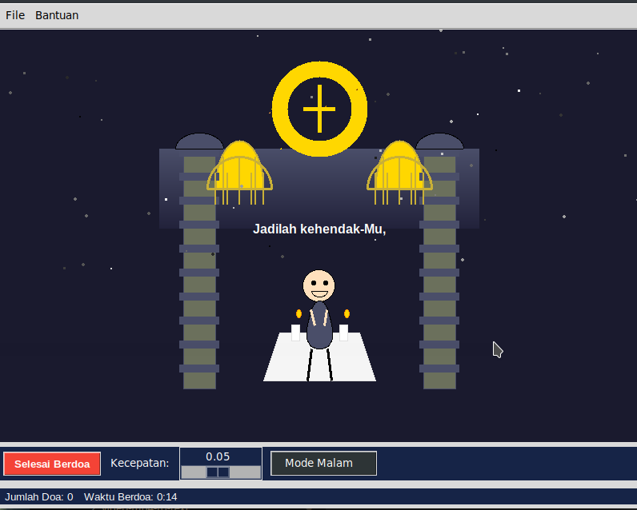

# Advanced Christian Prayer Simulation 🙏

A sophisticated interactive prayer visualization application built with Python and Tkinter that creates an immersive spiritual experience through animations, particle effects, and dynamic lighting.



## Features ✨

### Visual Elements
- **Interactive Church Environment** 
  - Detailed church interior with gradient backgrounds
  - Animated stained glass windows
  - Dynamic altar and decorative elements
  - Day/night mode transitions

### Animation Systems
- **Praying Character Animation**
  - Smooth, natural prayer movements
  - Facial expressions and gestures
  - Responsive arm and body movements

### Special Effects
- **Divine Light System**
  - Pulsating golden light
  - Dynamic intensity changes
  - Atmospheric glow effects

- **Particle System**
  - Floating prayer particles
  - Color transitions
  - Natural movement patterns

### Interactive Features
- **Prayer Controls**
  - Start/Stop prayer sessions
  - Adjustable animation speed
  - Day/Night mode toggle

### Tracking & Statistics
- **Prayer Statistics**
  - Session duration tracking
  - Prayer count monitoring
  - Historical data storage
  - Viewable prayer history

## Installation 🚀

### Prerequisites
- Python 3.7 or higher
- Tkinter (usually comes with Python)
- PIL (Python Imaging Library)

### Setup
1. Clone the repository:
```bash
git clone https://fico-aditama/tkinter-simulation.git
cd tkinter-simulation
```

2. Install required packages:
```bash
pip install Pillow
```

3. Run the application:
```bash
python app_christian_pray_simulation.py
```

## Usage 📖

### Starting the Application
Run the main script to launch the application:
```python
if __name__ == "__main__":
    app = AdvancedPrayerAnimation()
    app.add_keyboard_shortcuts()
    app.add_menu()
    app.mainloop()
```

### Controls
- **Space Bar**: Start/Stop prayer
- **Escape**: Exit application
- **H**: View prayer history
- Mouse controls for UI interaction

### Interface Elements
- **Main Window**: Displays the church environment and praying character
- **Control Panel**: Contains buttons and sliders for interaction
- **Statistics Panel**: Shows prayer duration and count

## Customization 🎨

### Modifying Prayer Texts
You can customize the prayer texts by modifying the `prayers` list in the code:
```python
self.prayers = [
    "Your prayer line 1",
    "Your prayer line 2",
    # Add more lines as needed
]
```

### Visual Customization
Adjust colors and dimensions in the initialization:
```python
# Change background color
self.canvas.configure(bg='#YOUR_COLOR_CODE')

# Modify window size
self.geometry("WIDTH x HEIGHT")
```

## Key Files 📁

- `app_christian_pray_simulation.py`: Main application file
- `prayer_stats.txt`: Stores prayer statistics
- `sounds/`: Directory containing sound effects (optional)

## Technical Details 🔧

### Architecture
- Built using Object-Oriented Programming principles
- Tkinter for GUI components
- Custom animation and particle systems
- File-based data persistence

### Performance Considerations
- Optimized particle system for smooth performance
- Efficient animation calculations
- Resource-conscious design

## License 📄

This project is licensed under the MIT License - see the [LICENSE](LICENSE) file for details.

---

Made with ❤️ and Python